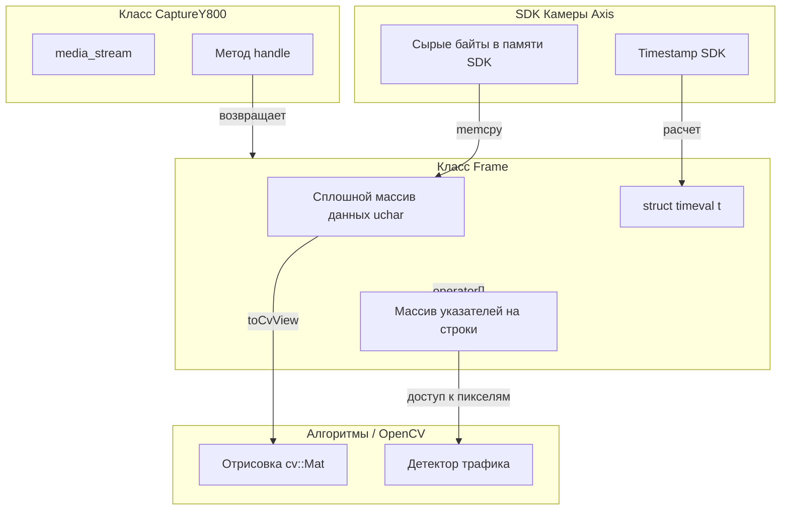

# camera-models

```mermaid
graph TD
    subgraph SDK_Camera [SDK Камеры Axis]
        RawData[Сырые байты в памяти SDK]
        TS[Timestamp SDK]
    end

    subgraph CaptureHandler [Класс CaptureY800]
        Stream[media_stream]
        Handle[Метод handle]
    end

    subgraph DataStructs [Класс Frame]
        Buffer[Сплошной массив данных uchar]
        Rows[Массив указателей на строки]
        Time[struct timeval t]
    end

    subgraph Processing [Алгоритмы / OpenCV]
        Detect[Детектор трафика]
        Draw[Отрисовка cv::Mat]
    end

    %% Потоки данных
    RawData -- memcpy --> Buffer
    TS -- расчет --> Time
    Handle -- возвращает --> DataStructs
    
    DataStructs -- operator[] --> Rows
    Rows -- доступ к пикселям --> Detect
    Buffer -- toCvView --> Draw
```