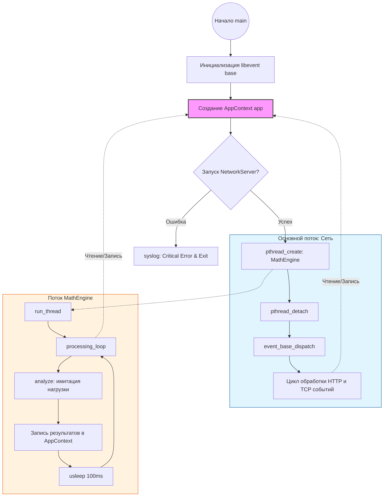
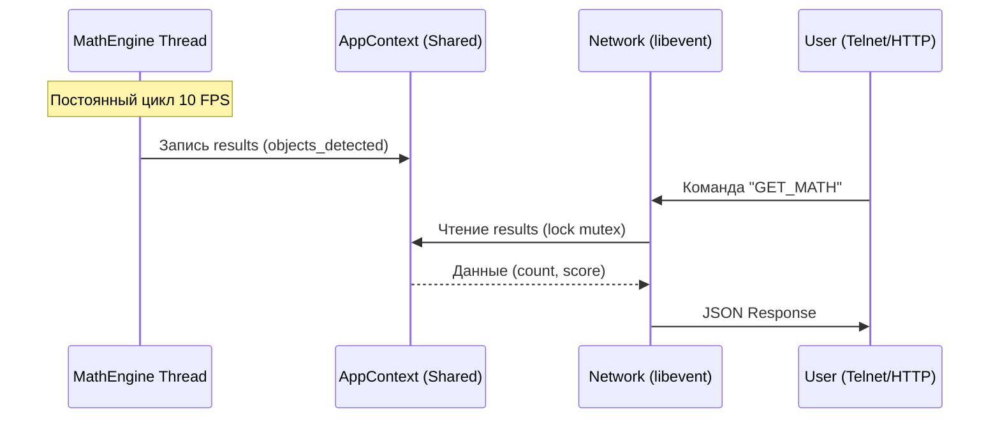

# camera-server

Как читать эту схему:
AppContext (розовый блок): Это центральное хранилище (Shared Context), через которое общаются два независимых потока.
Синий блок (Main Thread): Здесь крутится libevent. Он отвечает на ваши запросы GET_MATH и GET /api/info. Он "спит", пока не придет пакет по сети.
Оранжевый блок (Math Process): Это тот самый цикл, который вы настраивали. Он работает параллельно и постоянно грузит процессор вычислениями.
Пунктирные стрелки: Показывают доступ к общим данным под защитой мьютексов.

Диаграмма последовательности (Sequence Diagram)
Показать именно логику запроса (например, как данные попадают из MathEngine к вам в Telnet):

