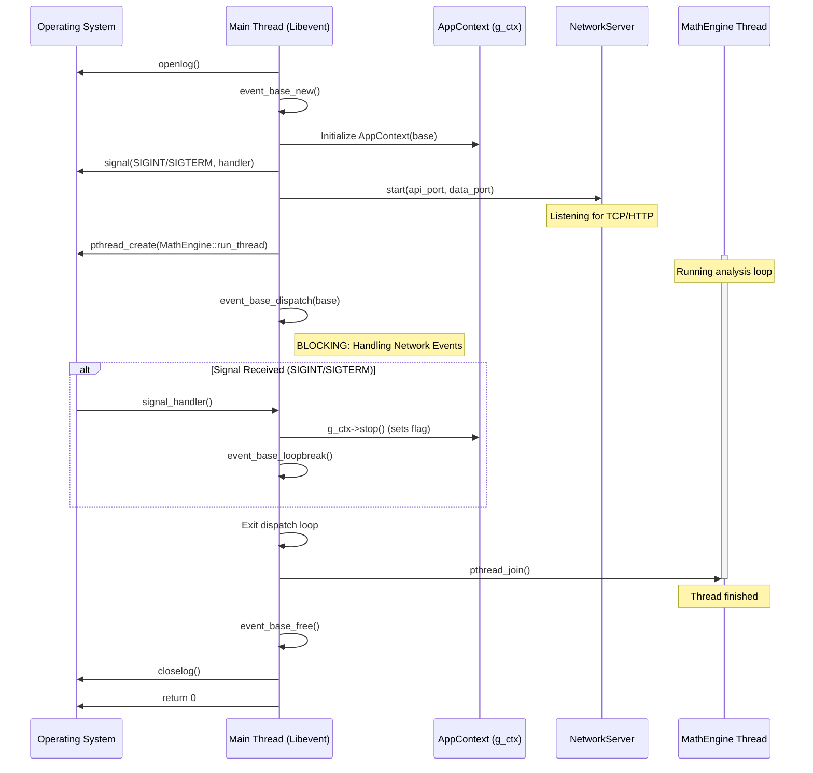
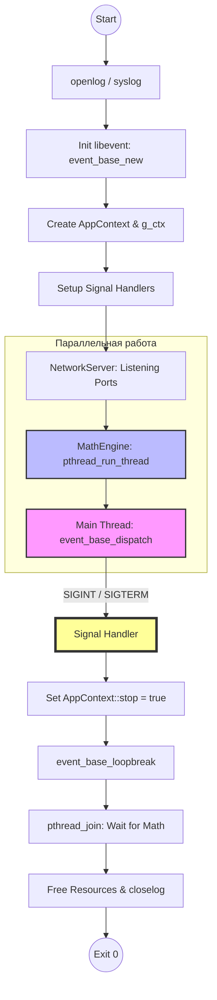
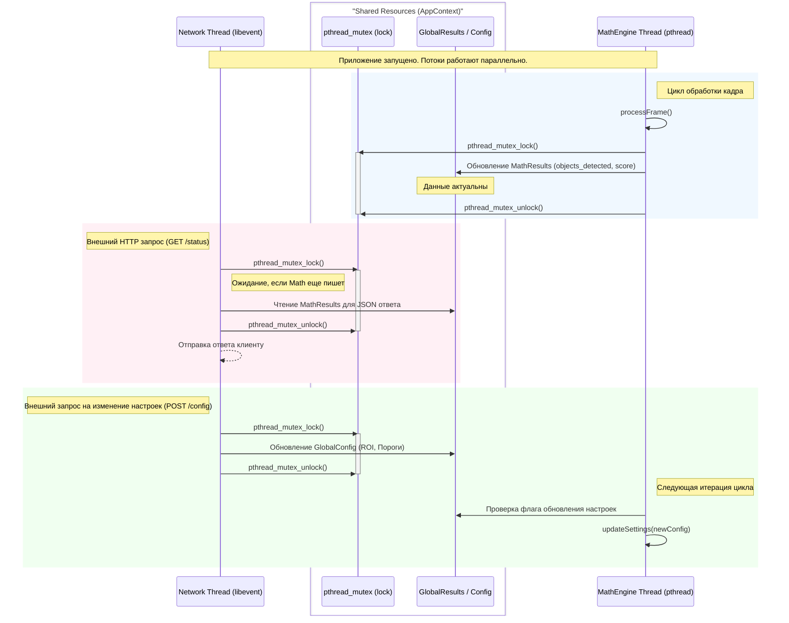

## main.cpp

Диаграмма последовательности (Sequence Diagram) показывает разделение на Основной поток (Network/Libevent) и Математический поток (pthread).

Диаграмма архитектуры и потоков данных (Flowchart)

Блокировка: event_base_dispatch помечен как блокирующий вызов основного потока.
Асинхронность: Видно, что MathEngine работает независимо в pthread_t.
Безопасный выход: Показана цепочка Signal -> Stop Flag -> Loopbreak -> Join, которая гарантирует, что ресурсы не будут освобождены, пока математический поток не закончит работу.

Диаграмма взаимодействия потоков через AppContext
Для визуализации взаимодействия между NetworkServer и MathEngine через AppContext (мьютексы и общие данные), на диаграмму добавлены механизмы синхронизации.
В данной архитектуре AppContext выступает в роли Shared Memory, а pthread_mutex_t гарантирует, что сетевой поток не прочитает данные в момент их записи математическим движком.

Ключевые архитектурные решения на схеме:
Защита критической секции: Оба потока обращаются к pthread_mutex_lock перед доступом к MathResults (результаты) или GlobalConfig (настройки). Это предотвращает Race Condition.
Событийная модель (Net): Сетевой поток "спит" в libevent до прихода запроса, в то время как MathEngine работает в непрерывном цикле.
Атомарность обновлений: Благодаря блокировке, сетевой клиент никогда не получит "наполовину записанный" результат (например, когда objects_detected уже обновился, а last_score еще нет).
