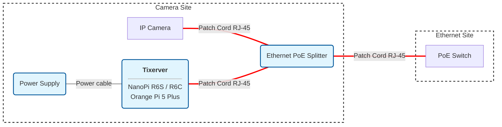

```mermaid
    graph LR
        subgraph cs ["Camera Site"]
            direction TB
            1[IP Camera]
            2(Ethernet PoE Splitter)
        
            3("<b>Tixerver</b><hr/>NanoPi R6S / R6C<br/>Orange Pi 5 Plus")
        
            4(Power Supply)

            1 ---|"Patch Cord RJ-45"| 2
            3 ---|"Patch Cord RJ-45"| 2
            4 ---|"Power cable"| 3
        end

        subgraph es ["Ethernet Site"]
            5[PoE Switch]
        end

        2 ---|"Patch Cord RJ-45"| 5

    style cs fill:none,stroke:#333,stroke-width:2px,stroke-dasharray:5,5
    style es fill:none,stroke:#333,stroke-width:2px,stroke-dasharray:5,5
    
    style 2 fill:#e1f5fe,stroke:#01579b,stroke-width:2px
    style 3 fill:#e1f5fe,stroke:#01579b,stroke-width:2px
    style 4 fill:#e1f5fe,stroke:#01579b,stroke-width:2px

    linkStyle 0,1,3 stroke:red,stroke-width:3px
```